# Sin tácticas 

## Caso base

```yaml
phases:
- name: Warm up
  duration: 60
  arrivalRate: 2
- name: Ramp up
  duration: 30
  arrivalRate: 2
  rampTo: 10
- name: Plain
  duration: 60
  arrivalRate: 10
- name: Ramp down
  duration: 30
  arrivalRate: 10
  rampTo: 2
- name: Cool down
  duration: 60
  arrivalRate: 2
```

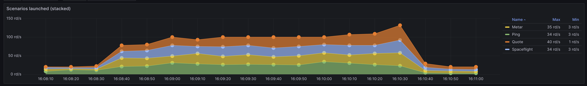
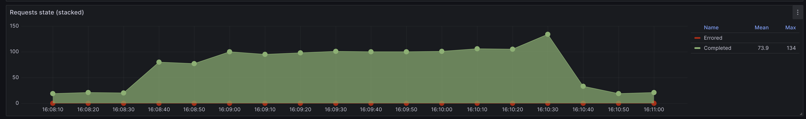
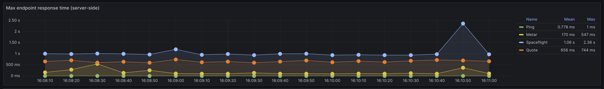
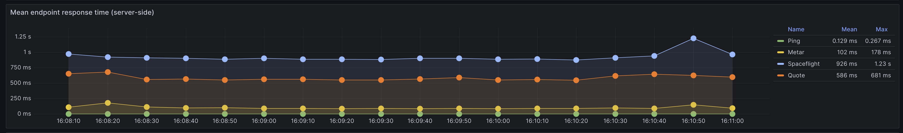
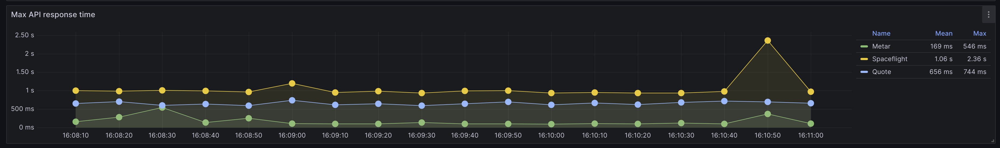
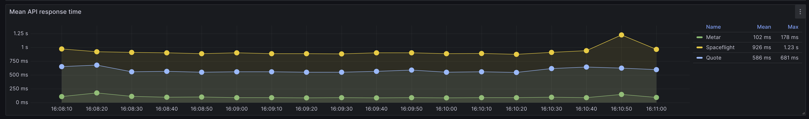
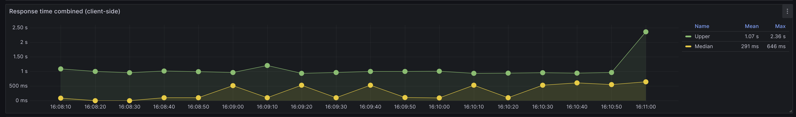
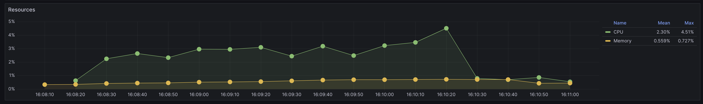

## Stress

```yaml
phases:
- name: Warm up
  duration: 60
  arrivalRate: 2
- name: Ramp up
  duration: 30
  arrivalRate: 2
  rampTo: 100
- name: Plain
  duration: 60
  arrivalRate: 100
- name: Ramp down
  duration: 30
  arrivalRate: 100
  rampTo: 2
- name: Cool down
  duration: 60
  arrivalRate: 2
```

Empezó a fallar la api de Quote, el log de Node de las requests fallidas es el siguiente:

```log
2c23-tp-1-node-1      | AxiosError: Request failed with status code 429
2c23-tp-1-node-1      |     at settle (/opt/app/node_modules/axios/dist/node/axios.cjs:1913:12)
2c23-tp-1-node-1      |     at IncomingMessage.handleStreamEnd (/opt/app/node_modules/axios/dist/node/axios.cjs:2995:11)
2c23-tp-1-node-1      |     at IncomingMessage.emit (node:events:529:35)
2c23-tp-1-node-1      |     at endReadableNT (node:internal/streams/readable:1368:12)
2c23-tp-1-node-1      |     at process.processTicksAndRejections (node:internal/process/task_queues:82:21) {
2c23-tp-1-node-1      |   code: 'ERR_BAD_REQUEST',
2c23-tp-1-node-1      |   config: {
2c23-tp-1-node-1      |     transitional: {
2c23-tp-1-node-1      |       silentJSONParsing: true,
2c23-tp-1-node-1      |       forcedJSONParsing: true,
2c23-tp-1-node-1      |       clarifyTimeoutError: false
2c23-tp-1-node-1      |     },
2c23-tp-1-node-1      |     adapter: 'http',
2c23-tp-1-node-1      |     transformRequest: [ [Function: transformRequest] ],
2c23-tp-1-node-1      |     transformResponse: [ [Function: transformResponse] ],
2c23-tp-1-node-1      |     timeout: 0,
2c23-tp-1-node-1      |     xsrfCookieName: 'XSRF-TOKEN',
2c23-tp-1-node-1      |     xsrfHeaderName: 'X-XSRF-TOKEN',
2c23-tp-1-node-1      |     maxContentLength: -1,
2c23-tp-1-node-1      |     maxBodyLength: -1,
2c23-tp-1-node-1      |     env: { FormData: [Function], Blob: [class Blob] },
2c23-tp-1-node-1      |     validateStatus: [Function: validateStatus],
2c23-tp-1-node-1      |     headers: Object [AxiosHeaders] {
2c23-tp-1-node-1      |       Accept: 'application/json, text/plain, */*',
2c23-tp-1-node-1      |       'Content-Type': undefined,
2c23-tp-1-node-1      |       'User-Agent': 'axios/1.5.0',
2c23-tp-1-node-1      |       'Accept-Encoding': 'gzip, compress, deflate, br'
2c23-tp-1-node-1      |     },
2c23-tp-1-node-1      |     method: 'get',
2c23-tp-1-node-1      |     url: 'https://api.quotable.io/random',
2c23-tp-1-node-1      |     data: undefined

.... mucho texto al pedo

2c23-tp-1-node-1      |   },
2c23-tp-1-node-1      |   response: {
2c23-tp-1-node-1      |     status: 429,
2c23-tp-1-node-1      |     statusText: 'Too Many Requests',
2c23-tp-1-node-1      |     headers: Object [AxiosHeaders] {
2c23-tp-1-node-1      |       server: 'Cowboy',
2c23-tp-1-node-1      |       connection: 'close',
2c23-tp-1-node-1      |       'x-powered-by': 'Express',
2c23-tp-1-node-1      |       'access-control-allow-origin': '*',
2c23-tp-1-node-1      |       'ratelimit-limit': '220',
2c23-tp-1-node-1      |       'ratelimit-remaining': '0',
2c23-tp-1-node-1      |       'ratelimit-reset': '5',
2c23-tp-1-node-1      |       'retry-after': '60',
2c23-tp-1-node-1      |       'content-type': 'application/json; charset=utf-8',
2c23-tp-1-node-1      |       'content-length': '54',
2c23-tp-1-node-1      |       etag: 'W/"36-CyLO6/zPS4/+OW172LROq6sZ/l0"',
2c23-tp-1-node-1      |       date: 'Tue, 03 Oct 2023 19:15:32 GMT',
2c23-tp-1-node-1      |       via: '1.1 vegur'
2c23-tp-1-node-1      |     },
2c23-tp-1-node-1      |     config: {
2c23-tp-1-node-1      |       transitional: [Object],
2c23-tp-1-node-1      |       adapter: 'http',
2c23-tp-1-node-1      |       transformRequest: [Array],
2c23-tp-1-node-1      |       transformResponse: [Array],
2c23-tp-1-node-1      |       timeout: 0,
2c23-tp-1-node-1      |       xsrfCookieName: 'XSRF-TOKEN',
2c23-tp-1-node-1      |       xsrfHeaderName: 'X-XSRF-TOKEN',
2c23-tp-1-node-1      |       maxContentLength: -1,
2c23-tp-1-node-1      |       maxBodyLength: -1,
2c23-tp-1-node-1      |       env: [Object],
2c23-tp-1-node-1      |       validateStatus: [Function: validateStatus],
2c23-tp-1-node-1      |       headers: [Object [AxiosHeaders]],
2c23-tp-1-node-1      |       method: 'get',
2c23-tp-1-node-1      |       url: 'https://api.quotable.io/random',
2c23-tp-1-node-1      |       data: undefined
2c23-tp-1-node-1      |     },
2c23-tp-1-node-1      |     request: <ref *1> ClientRequest {
2c23-tp-1-node-1      |       _events: [Object: null prototype],
2c23-tp-1-node-1      |       _eventsCount: 7,
2c23-tp-1-node-1      |       _maxListeners: undefined,
2c23-tp-1-node-1      |       outputData: [],
2c23-tp-1-node-1      |       outputSize: 0,
2c23-tp-1-node-1      |       writable: true,
2c23-tp-1-node-1      |       destroyed: false,
2c23-tp-1-node-1      |       _last: true,
2c23-tp-1-node-1      |       chunkedEncoding: false,
2c23-tp-1-node-1      |       shouldKeepAlive: false,
2c23-tp-1-node-1      |       maxRequestsOnConnectionReached: false,
2c23-tp-1-node-1      |       _defaultKeepAlive: true,
2c23-tp-1-node-1      |       useChunkedEncodingByDefault: false,
2c23-tp-1-node-1      |       sendDate: false,
2c23-tp-1-node-1      |       _removedConnection: false,
2c23-tp-1-node-1      |       _removedContLen: false,
2c23-tp-1-node-1      |       _removedTE: false,
2c23-tp-1-node-1      |       strictContentLength: false,
2c23-tp-1-node-1      |       _contentLength: 0,
2c23-tp-1-node-1      |       _hasBody: true,
2c23-tp-1-node-1      |       _trailer: '',
2c23-tp-1-node-1      |       finished: true,
2c23-tp-1-node-1      |       _headerSent: true,
2c23-tp-1-node-1      |       _closed: false,
2c23-tp-1-node-1      |       socket: [TLSSocket],
2c23-tp-1-node-1      |       _header: 'GET /random HTTP/1.1\r\n' +
2c23-tp-1-node-1      |         'Accept: application/json, text/plain, */*\r\n' +
2c23-tp-1-node-1      |         'User-Agent: axios/1.5.0\r\n' +
2c23-tp-1-node-1      |         'Accept-Encoding: gzip, compress, deflate, br\r\n' +
2c23-tp-1-node-1      |         'Host: api.quotable.io\r\n' +
2c23-tp-1-node-1      |         'Connection: close\r\n' +
2c23-tp-1-node-1      |         '\r\n',
2c23-tp-1-node-1      |       _keepAliveTimeout: 0,
2c23-tp-1-node-1      |       _onPendingData: [Function: nop],
2c23-tp-1-node-1      |       agent: [Agent],
2c23-tp-1-node-1      |       socketPath: undefined,
2c23-tp-1-node-1      |       method: 'GET',
2c23-tp-1-node-1      |       maxHeaderSize: undefined,
2c23-tp-1-node-1      |       insecureHTTPParser: undefined,
2c23-tp-1-node-1      |       joinDuplicateHeaders: undefined,
2c23-tp-1-node-1      |       path: '/random',
2c23-tp-1-node-1      |       _ended: true,
2c23-tp-1-node-1      |       res: [IncomingMessage],
2c23-tp-1-node-1      |       aborted: false,
2c23-tp-1-node-1      |       timeoutCb: null,
2c23-tp-1-node-1      |       upgradeOrConnect: false,
2c23-tp-1-node-1      |       parser: null,
2c23-tp-1-node-1      |       maxHeadersCount: null,
2c23-tp-1-node-1      |       reusedSocket: false,
2c23-tp-1-node-1      |       host: 'api.quotable.io',
2c23-tp-1-node-1      |       protocol: 'https:',
2c23-tp-1-node-1      |       _redirectable: [Writable],
2c23-tp-1-node-1      |       [Symbol(kCapture)]: false,
2c23-tp-1-node-1      |       [Symbol(kBytesWritten)]: 0,
2c23-tp-1-node-1      |       [Symbol(kNeedDrain)]: false,
2c23-tp-1-node-1      |       [Symbol(corked)]: 0,
2c23-tp-1-node-1      |       [Symbol(kOutHeaders)]: [Object: null prototype],
2c23-tp-1-node-1      |       [Symbol(errored)]: null,
2c23-tp-1-node-1      |       [Symbol(kHighWaterMark)]: 16384,
2c23-tp-1-node-1      |       [Symbol(kRejectNonStandardBodyWrites)]: false,
2c23-tp-1-node-1      |       [Symbol(kUniqueHeaders)]: null
2c23-tp-1-node-1      |     },
2c23-tp-1-node-1      |     data: { statusCode: 429, statusMessage: 'Too Many Requests' }
2c23-tp-1-node-1      |   }
2c23-tp-1-node-1      | }
```

LLegando al maximo de requests por segundo a la api de Quote (270 por seg) el servidor empezó a devolver status 429. En el grafico de max api response time y mean api response time podemos ver que faltan puntos de entrada a partir del tiempo 16:14:00, eso es porqeu nos dejo de contestar por aprox 1 minuto, y lo mismo se repite despues. 

En el log de la response vemos que el rate-limit del servidor son 220 requests, y dice "retry-after" 60 segundos. Esto condice con lo que vemos en los graficos. 

Tambien se ve que el uso de cpu de nuestro servidor llego al 45% en su punto maximo. 

Metar se ve que tiene picos de latencia alta, donde llega a 1.1 segundos de response time, mientras que en el promedio se mantiene en 200ms. 


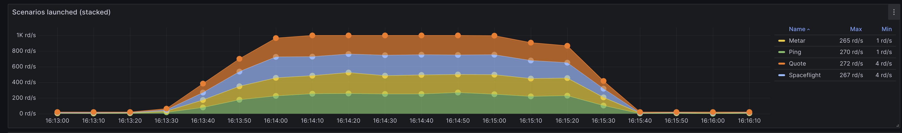
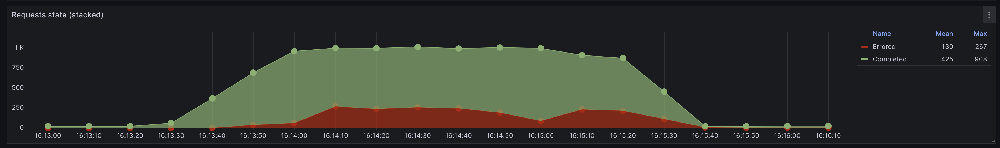
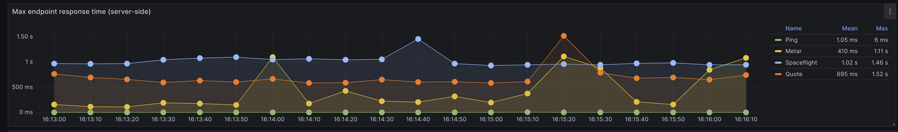
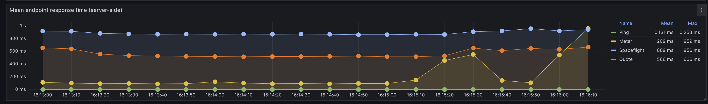
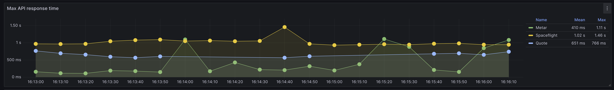
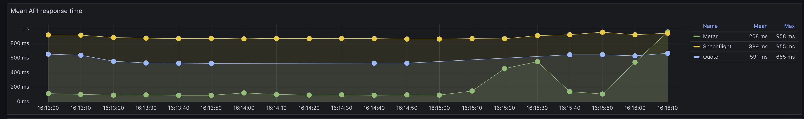
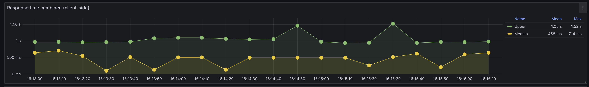
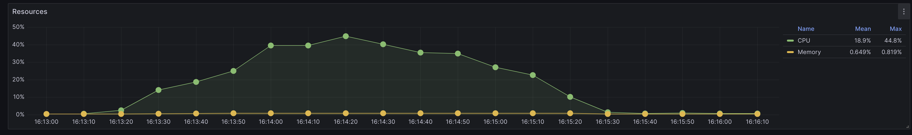