## Introducción

En este Trabajo Práctico, se compararon diferentes tácticas y tecnologías para analizar cómo es el impacto en los atributos de calidad de un servicio HTTP implementado en Node con Express. Para ello, se implementó una API que, mediante el consumo de otras APIs externas, brindará distintos datos a los usuarios. Junto con `Artillery`, se sometió a los endpoints a diversas intensidades de carga y distintas configuraciones, para medir y analizar los resultados obtenidos.

El webserver que provee los distintos endpoints se encuentra dockerizado con junto con los servicios que nos ayudaron a tomar las mediciones sobre la API (`Graphite`, `Grafana` y `Cadvisor`), un servicio de base de datos para utilizar como caché (`Redis`) y también `Nginx` como servicio de reverse proxy y balanceador de carga.

Los endpoints que se desarrollaron para el webserver son los siguientes:

- `Ping`: para healthcheck
- `METAR`: para obtener información meteorológica de un aeródromo
- `Spaceflight News`: para obtener las últimas noticias sobre actividad espacial
- `Random Quote`: para obtener una cita famosa aleatoria.

A la hora de comparar las distintas tácticas se evaluaron distintos escenarios:
- Un caso base donde simplemente se realizan solicitudes a los distintos endpoints
- Uso de caching con mediante Redis
- Escalando el servicio a 3 réplicas
- Rate limiting para limitar el consumo de los distintos endpoint

Para evaluar estos escenarios se generaron distintos escenarios de carga para un posterior análisis de cómo afecta a los atributos de calidad de la aplicación.

## Escenarios

### Base:

El escenario base simula un caso de uso normal del servidor con baja tasa de solicitudes.

```yaml
phases:
- name: Warm up
  duration: 60
  arrivalRate: 2
- name: Ramp up
  duration: 30
  arrivalRate: 2
  rampTo: 10
- name: Plain
  duration: 60
  arrivalRate: 10
- name: Ramp down
  duration: 30
  arrivalRate: 10
  rampTo: 2
- name: Cool down
  duration: 60
  arrivalRate: 2
```

### Stress:

El escenario stress simula un uso más exaustivo del servidor con un mayor número de solicitudes.

```yaml
phases:
- name: Warm up
  duration: 60
  arrivalRate: 2
- name: Ramp up
  duration: 30
  arrivalRate: 2
  rampTo: 100
- name: Plain
  duration: 60
  arrivalRate: 100
- name: Ramp down
  duration: 30
  arrivalRate: 100
  rampTo: 2
- name: Cool down
  duration: 60
  arrivalRate: 2
```


# Tácticas

## Caso sin tácticas


Este caso consta de una configuración inicial sin tácticas implementadas, donde simplemente se utiliza a Nginx como proxy reverso y un servidor (nodo) que se conecta con las APIs externas a cada solicitud recibida.


### Escenario base:


En el primer gráfico podemos observar la cantidad de solicitudes al servidor desglosadas por endpoint. Y en el segundo gráfico los resultados de dichas solicitudes, destacando que todas fueron ejecutadas correctamente.


Estos gráficos representan el tiempo total de respuesta que le lleva a cada uno de los endpoints de la API, medido desde el lado del servidor.


Aquí se representa el tiempo de respuesta para obtener la información de cada API externa. Podemos observar que `/space_flight` y `/quote` son los cuales presentan mayor latencia, llegando a superar la barrera del segundo.


En el primer gráfico, vemos el tiempo de respuesta combinado desde el lado del cliente, que es similar al anterior mencionado pero se le agrega la latencia que se tiene hasta llegar finalmente al cliente.

### Escenario stress:

Al iniciarlo, empezamos a obtener fallas provenientes de la API de Quote.
Del reporte de Node, pudimos obtener que se trata de errores 429 (Too Many Requests) y que el servidor de destino especifica que el rate-limit es de 220 por minuto y un retry-after de 60 segundos.


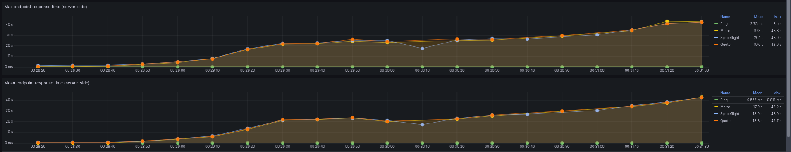
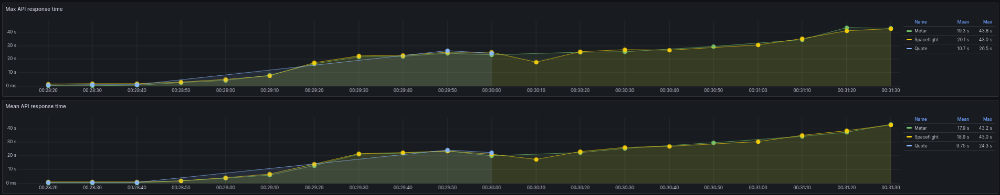

Podemos observar que los endpoints con conexiones a APIs externas tienen una peor performance ante el estrés que el caso de `/ping`. También, `/metar` muestra ser el de mejor rendimiento en todas las pruebas con saltos en latencia más leves que los otros.


Aquí se puede observar que el `/quote` presenta un comportamiento lineal en periodos de 60 segundos y eso es debido a la limitación de solicitudes impuesta por el servidor externo. Durante ese periodo, todas las solicitudes fueron rechazadas.


Al tener un sólo nodo atendiendo todas las solicitudes, el CPU muestra un pico máximo de 47.6%, mientras que la memoria no sufrió cambios significativos en toda la prueba.


## Técnica Caché


Este caso tiene una implementacción de base de datos Redis para la caché. La información será almacenada por un periodo de 3 segundos para así disminuir la cantidad de solicitudes a las APIs externas.


## Escenario base

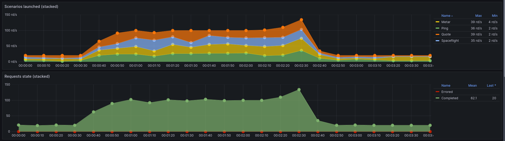
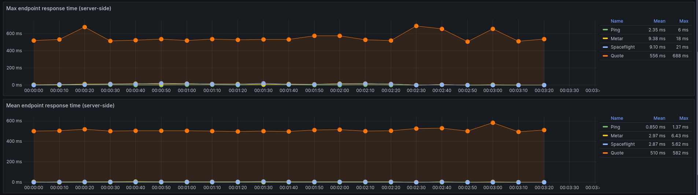

En estos dos últimos gráficos, se debería observar unos tiempos de respuesta promedio más alto para "metar" y "spaceflight", 
ya que aunque se encuentra almacenado en caché, cada 3 segundos se realiza una nueva petición a la API externa, lo que debería incremental el valor promedio en esa zona.

Para comprobarlo corrimos algunas pruebas en otra máquina y esta vez si obtuvimos los resultados esperados.


Si tomamos el caso de "Spaceflight" sin caché, podemos ver que cuando realiza las solicitudes al servidor tarda más de 1 segundo en promedio, pero cuando utiliza la caché el promedio baja a 247ms, por lo que la mejora es significativa al implementar esta táctica.

Si en el gráfico tuvieramos más granularidad podriamos observar picos de latencia cada 3 segundos cuando se invalida la caché. Como las mediciones se realizan cada 10 segundos, en el gráfico de arriba (el de máximos) estamos viendo solo los puntos más altos de latencia, mientras que en el gráfico de abajo vemos el promedio que es mucho más bajo.


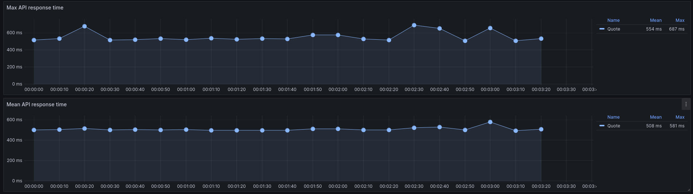
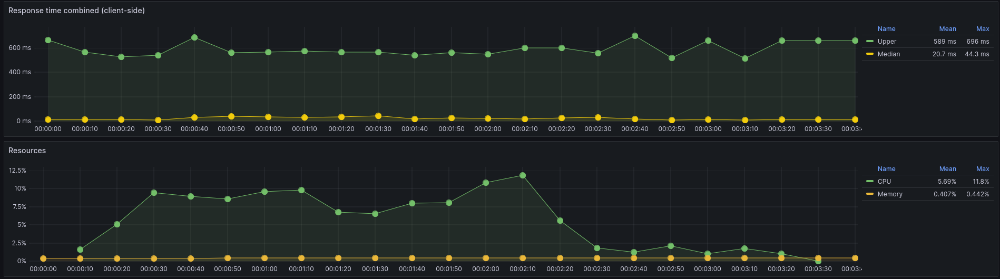


## Escenario stress

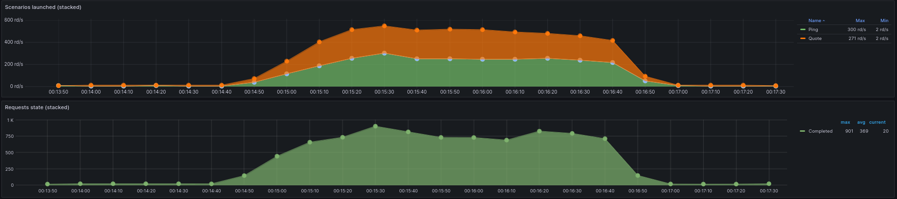

Aquí se puede observar un aumento de las solicitudes con errores. Esto se puede explicar por el endpoint "/quote", el cual no posee implementación de caché pero lo seguimos evaluando para su comparativa con el resto de los endpoint en términos de rendimiento general. También consideramos que dicha API externa no es tan robusta como las demás para este tipo de usos. 

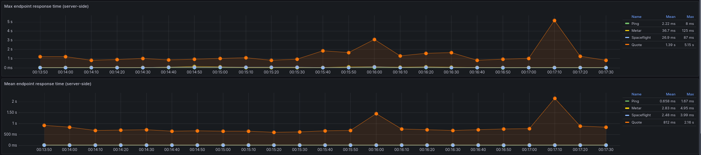

Podemos observar que "Max endpoint response time" nos arroja unos resultados más constantes en el caso de "Spaceflight" y "Metar" comparando con el escenario Stress sin caché. Ya no aparecen picos de latencia alta.

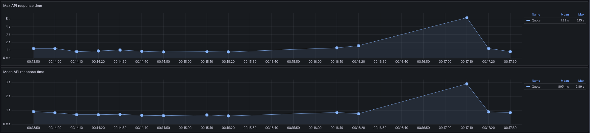
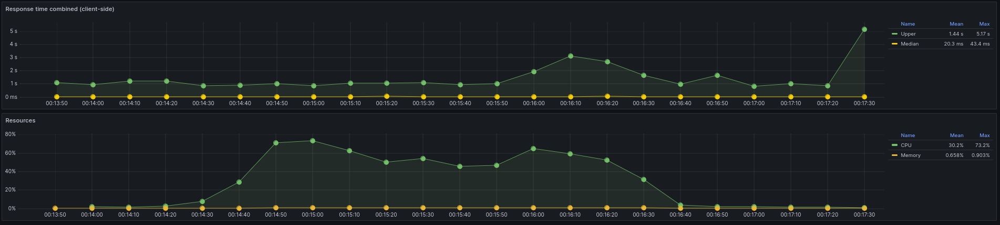
No se observan cambios significativos en el uso de la memoria.

# Replicación


En este caso, cambiamos la configuración de Nginx de Proxy reverso por el de Balanceador de carga. De esta forma, y agregando dos nodos más, Nginx se encargará de la distribución de las solicitudes de cada endpoint entre los tres nodos.

## Caso base


No se observaron errores en las solicitudes.

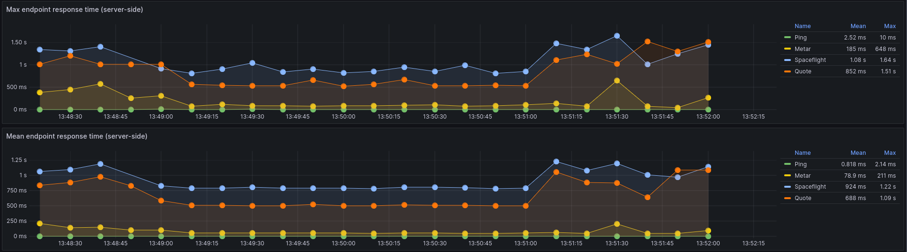

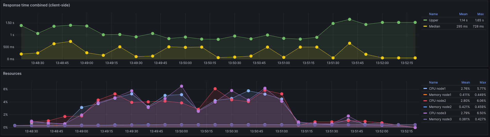
En este gráfico podemos observar que la distribución de carga del CPU y la memoria es equitativa entre los nodos. Si comparamos este escenario base con el de un solo nodo, podemos ver similitudes en los datos, por lo que consideramos que los valores de CPU y memoria son los mínimos para su funcionamiento y no dependen exclusivamente del uso de los endpoint.


## Stress

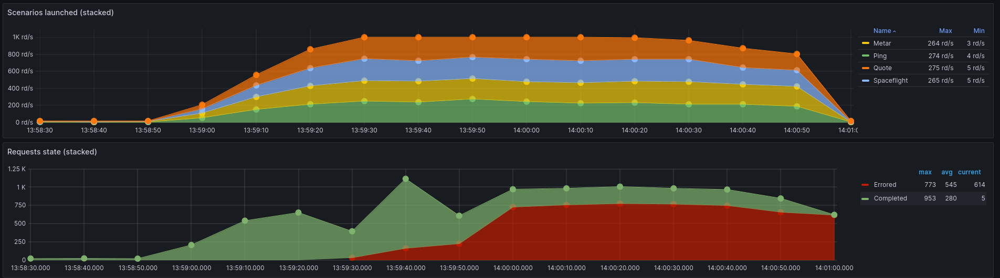


# Rate limiting


Este caso, se agrega una limitación de 10 solicitudes por segundo.


## Caso base


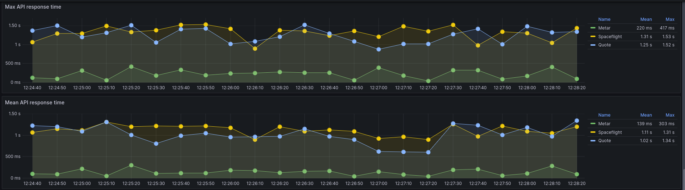


## Stress


# Replicación + Caché 


Este caso, se combinan ambas técnicas de Replicación y caché.

## Caso base


## Stress


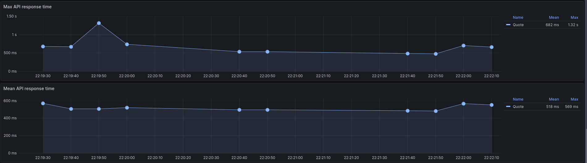


