## Tp. Nro. 1: Tácticas 

## Reentrega

## Materia: Arquitectura del Software (75.73)

**Alumnos**:
  * Gorge Julián, 104286
  * Marelli Felipe, 106521
  * Alvarez Windey Juan, 95242
  * Rettori Julián, 106581

**Fecha de Entrega: 05/10/2023**

**Fecha de Reentrega: 25/10/2023**

---


## Introducción

En este Trabajo Práctico, se compararon diferentes tácticas y tecnologías para analizar cómo es el impacto en los atributos de calidad de un servicio HTTP implementado en NodeJS y Express. Para ello, se implementó una API que, mediante el consumo de otras APIs externas, brindará distintos datos a los usuarios. Junto con `Artillery`, se sometió a los endpoints a diversas intensidades de carga y distintas configuraciones para medir y analizar los resultados obtenidos.

El webserver que provee los distintos endpoints se encuentra dockerizado con junto con los servicios que nos ayudaron a tomar las mediciones sobre la API (`Graphite`, `Grafana` y `Cadvisor`), un servicio de base de datos para utilizar como caché (`Redis`) y también `Nginx` como servicio de reverse proxy y balanceador de carga.

Los endpoints que se desarrollaron para el webserver son los siguientes:

- `Ping`: para health check.
- `METAR`: para obtener información meteorológica de un aeródromo.
- `Spaceflight News`: para obtener las últimas noticias sobre actividad espacial.
- `Random Quote`: para obtener una cita famosa aleatoria.

A la hora de comparar las distintas tácticas se evaluaron distintos escenarios:
- Un caso base donde simplemente se realizan solicitudes a los distintos endpoints.
- Uso de caching con mediante Redis.
- Escalando el servicio a 3 réplicas.
- Rate limiting para limitar el consumo de los distintos endpoint.

Para evaluar estos escenarios se generaron distintos escenarios de carga para un posterior análisis de cómo afecta a los atributos de calidad de la aplicación.

## Escenarios

### Base:

El escenario base simula un caso de uso normal del servidor con baja tasa de solicitudes.

```yaml
phases:
- name: Warm up
  duration: 60
  arrivalRate: 2
- name: Ramp up
  duration: 30
  arrivalRate: 2
  rampTo: 10
- name: Plain
  duration: 60
  arrivalRate: 10
- name: Ramp down
  duration: 30
  arrivalRate: 10
  rampTo: 2
- name: Cool down
  duration: 60
  arrivalRate: 2
```

### Stress:

El escenario stress simula un uso más exaustivo del servidor con un mayor número de solicitudes.

```yaml
phases:
- name: Warm up
  duration: 60
  arrivalRate: 2
- name: Ramp up
  duration: 30
  arrivalRate: 2
  rampTo: 100
- name: Plain
  duration: 60
  arrivalRate: 100
- name: Ramp down
  duration: 30
  arrivalRate: 100
  rampTo: 2
- name: Cool down
  duration: 60
  arrivalRate: 2
```


# Tácticas

## Caso sin tácticas


Este caso consta de una configuración inicial sin tácticas implementadas, donde simplemente se utiliza a Nginx como proxy reverso y un servidor (nodo) que se conecta con las APIs externas a cada solicitud recibida.


### Escenario base:


En el primer gráfico podemos observar la cantidad de solicitudes al servidor desglosadas por endpoint. Y en el segundo gráfico los resultados de dichas solicitudes, destacando que todas fueron ejecutadas correctamente.

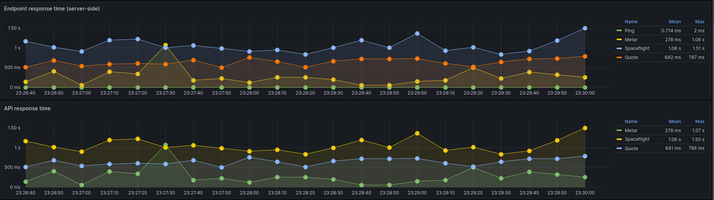
Estos gráficos representan el tiempo total de respuesta que le lleva a cada uno de los endpoints de la API, medido desde el lado del servidor.


Aquí se representa el tiempo de respuesta para obtener la información de cada API externa. Podemos observar que `/space_flight` y `/quote` son los cuales presentan mayor latencia, llegando a superar la unidad de segundos.

En el primer gráfico, vemos el tiempo de respuesta combinado desde el lado del cliente, que es similar al anterior mencionado pero se le agrega la latencia que se tiene hasta llegar finalmente al cliente.

### Escenario stress:

Al iniciarlo, empezamos a obtener fallas provenientes de la API de Quote.
Del reporte de NodeJS, pudimos obtener que se trata de errores 429 (too many requests) y que el servidor de destino especifica que el rate-limit es de 220 por minuto y un retry-after de 60 segundos.


Podemos observar que los endpoints con conexiones a APIs externas tienen una peor performance ante el estrés que el caso de `/ping`. En el caso de `/metar`, se observa el de mejor rendimiento en todas las pruebas con saltos en latencia más leves que los otros.


Al tener un sólo nodo atendiendo todas las solicitudes, el CPU muestra un pico máximo de casi 60%, mientras que la memoria no sufrió cambios significativos en toda la prueba.


## Técnica Caché


Este caso tiene una implementacción de base de datos Redis para la caché. La información será almacenada por un periodo de 5 segundos para disminuir la cantidad de solicitudes a las APIs externas. Este periodo fue elegido ya que es el tiempo mínimo de cacheo que requieren dichas APIs para no tener errores en las pruebas de estrés. En el caso de que se requiera soportar más consultas a nuestros endpoints podríamos aumentar el tiempo de duración en caché ya que spaceflights_news no suele actualizarse tan frecuentemente.

## Escenario base

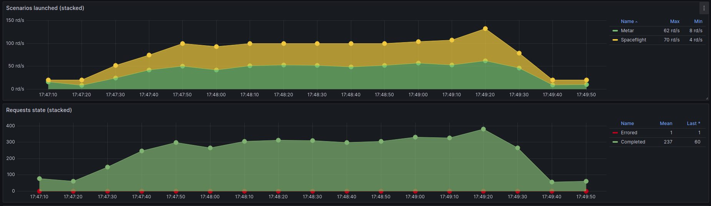

En esta táctica sólo tomamos los endpoints de `METAR` y `Spaceflight news`, esto es debido a que eran los dos únicos que tenían sentido usarlos con esta mejora, ya que `ping` no consulta ninguna API externa y `quote` es random cada vez que se lo invoca, por lo que es innecesario almacenar datos para estos 2 endpoints. 


En el gráfico "Endpoint response time", podemos observar para el endpoint de `METAR` pequeños picos donde la caché es invalidada y requiere volver a buscar los datos de la API externa.

Para el endpoint de `Spaceflight news` se visualiza el mismo efecto pero solo al principio. Además podemos ver que la diferencia de altura de los "picos" se debe al orden de magnitud de los tiempos de respuesta, siendo el máximo de `Spaceflight news` mucho mayor y provocando un corrimiento de la escala en el gráfico.

Para el "API response time" vemos que el tiempo en consultar las APIs externas se mantiene constante. 

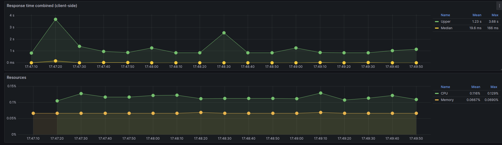

Si comparamos con el caso base sin tácticas, podemos ver que hay un uso menor de CPU pasando de 21,4% a 0,116% y además también hay un menor tiempo de respuesta del cliente, pasando de un promedio de 1.85seg a 1,23seg. Con esto podemos ver que en principio es una táctica eficiente cuando tiene sentido aplicarla en un endpoint.


## Escenario stress

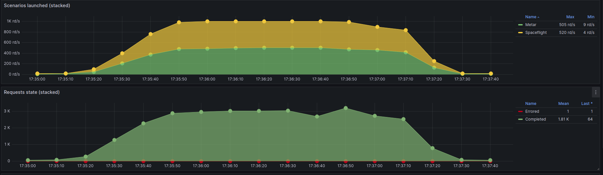

Nuevamente probamos sólo con los endpoints que tenía sentido: `METAR` y `Spaceflight news`. Si comparamos con la versión de stress sin tácticas, usando la caché no tuvimos pedidos con errores

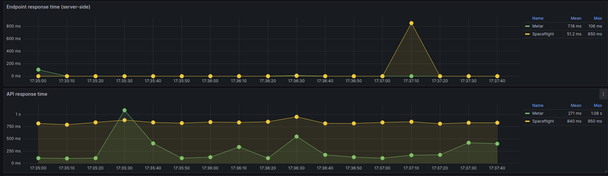

En "Endpoint response time" podemos ver que cuando se invalida la caché, el server tarda más ya que tiene que buscar de nuevo la información. Esto se puede ver en el pico de `Spaceflight news`, o bien en la media y los máximos de tiempo de respuesta para ambos endpoints, siendo la media más de diez veces menor a los tiempos máximos de respuesta. Nuevamente solo se puede apreciar graficamente un pico de `Spaceflight news` debidoa  que los máximos están en distintas magnitudes

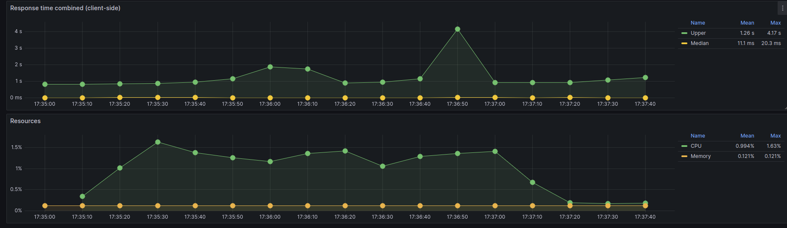

Si comparamos contra el caso sin tácticas bajo stress, podemos ver nuevamente un menor tiempo de respuesta promedio y un menor uso del CPU promedio.

# Replicación


En este caso, cambiamos la configuración de Nginx de Proxy reverso por el de Balanceador de carga. De esta forma, y agregando dos nodos más, Nginx se encargará de la distribución de las solicitudes de cada endpoint entre los tres nodos.

## Caso base


No se observaron errores en las solicitudes.


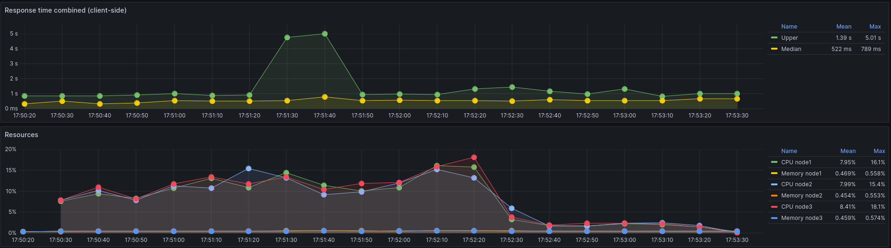
En este gráfico podemos observar que la distribución de carga del CPU y la memoria es medianamente igual entre los nodos. 

Si comparamos este escenario con el caso base de un solo nodo, podemos ver que la carga por nodo disminuyó ua se distribuyó el procesamiento de los pedidos en los tres nodos.


## Stress

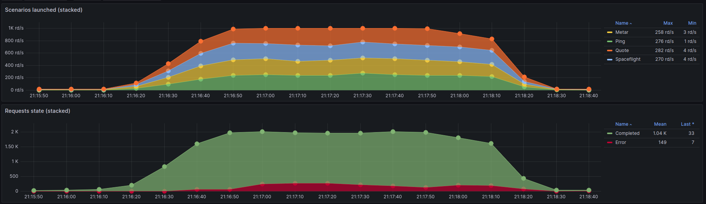

En este caso, podemos ver que la API externa es un limitante a la  cantidad de solicitudes independientemente de la táctica de balanceador de carga.

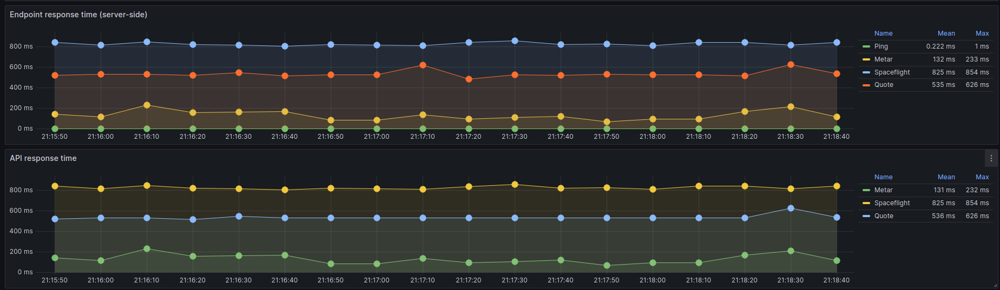


Aquí el uso de CPU se ve reducido notablemente gracias a la distribución de solicitudes en distintos nodos.


# Rate limiting


Este caso, se agrega una limitación de 10 solicitudes por segundo.


## Caso base


Como podemos ver las solicitudes completadas se mantienen como una constante y luego las que superan el umbral marcado con rate limiting son limitadas por nginx respondiendo con un codigo 503 (En el grafico se las marcó como "Error"). 


También se puede observar un uso menor del CPU si lo comparamos con el caso base sin tácticas, pasando de un uso promedio de 21,4% a un uso promedio de 4,22%. Esto en principio tiene sentido, ya que los pedidos por encima del umbral se los descarta directamente y la cantidad a procesar se hace mucho menor.


## Stress


Nuevamente al igual que el caso base, notamos como los pedidos por encima del umbral (10 por segundo) son rechazados automaticamente. El valor de "Completed" no es 10, debido a que las estadísticas se agrupan y se actualizan cada 10 segundos.


En terminos generales, podemos ver un comportamiento similar al obtenido en la tactica 1 y sin mejoras significativas. En casos de estrés, pueden verse una mayor amplitud en el tiempo de ejecución.

# Replicación + Caché 


Este caso, se combinan ambas técnicas de Replicación y caché.

## Caso base

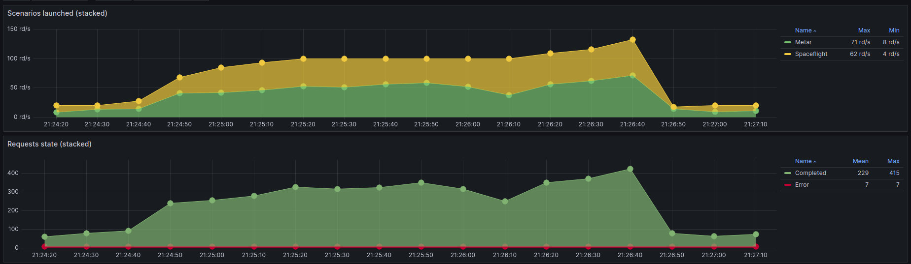

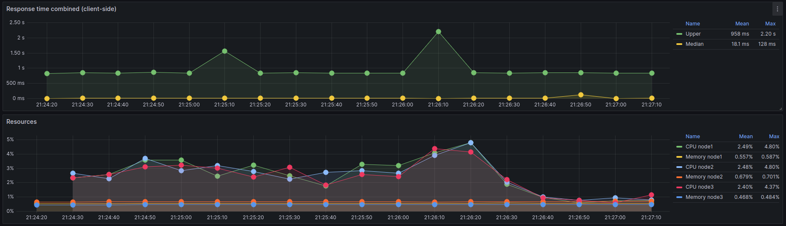

En este caso tuvimos mediciones similares a las de uso de caché con Redis. También podemos ver como se distribuyo la carga con los distintos nodos respecto del caso base (al igual como sucedió con el caso de replicas)


## Stress


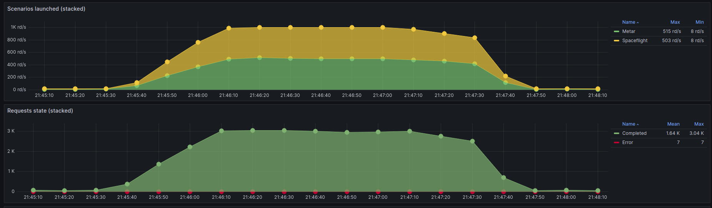

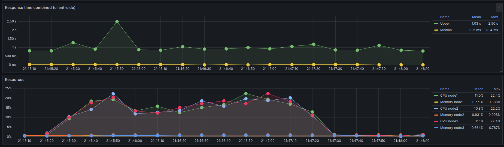

Al igual que en el caso anterior, las cargas fueron distribuidas en los distintos nodos. Por otro lado, pese al haber obtenido errores, estos fueron muchos menos que si los comparamos con el caso base de stress. 
Por último, vemos que los tiempos de respuesta de los endpoints fueron muy bajos debido al uso de caché.

## Conclusión